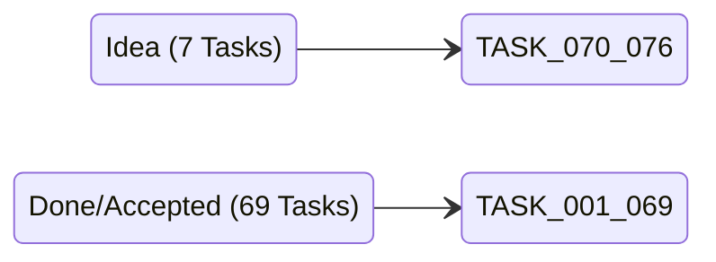

# ThinkIO Rebuild Current State Audit Report

**Date:** 2026-07-04  
**Audited Workspace:** `c:\Users\benja\Downloads\Thinkio-1\thinkio-rebuild`  
**Status:** **Healthy & Validation Passed**  

---

## 1. Executive Summary

As of July 4, 2026, **ThinkIO Rebuild** has successfully completed its core local-runtime library and successfully scaffolded and verified its first **VS Code extension shell** (completing TASK-064 through TASK-069).

The project is structured as a governed local project-work layer that ensures AI/model interactions are captured, routed, and validated according to strict state-transition laws before any mutation is applied to project files. The validation test suite passes with **104 tests** covering the entire kernel surface and the VS Code extension shell boundaries.

The system is now ready for local extension execution, smoke-testing, and manual validation. The next logical phase concerns remote provider integrations, deployment/installer polish, and marketplace preparation.

---

## 2. Validation & Test Suite Status

Latest full check command:
```sh
npm run check
```

### Validation Matrix
| Stage | Command | Status | Notes |
| :--- | :--- | :--- | :--- |
| **Node Version** | `node scripts/check-node-version.mjs` | **Passed** | Confirms Node >= 22.0.0 (Running: `v25.8.1`) |
| **TypeScript Typecheck** | `tsc --noEmit` | **Passed** | Ensures strict typing across all kernel modules and test files. |
| **CUE Schema Validation** | `node runtime/validate-schemas.ts` | **Passed** | Validates all 76 tasks and 8 state JSON files against CUE. |
| **VS Code Package Validation** | `node scripts/validate-vscode-extension-package.mjs` | **Passed** | Checks manifest, commands, views, and bundled media assets. |
| **Test Runner** | `node --experimental-strip-types --test tests/*.test.ts` | **Passed** | Runs **104 test cases** synchronously and asynchronously. |

---

## 3. Task Board & Implementation Summary

The project maintains a total of **76 governed tasks** modeled under `tasks/*.json`. The current Kanban layout projection reflects the following distribution:



### Kanban Distribution (`views/kanban.json` & `views/dashboard.json`)
*   **Done/Accepted (69 Tasks):** TASK-001 through TASK-069
*   **Idea (7 Tasks):** TASK-070 through TASK-076
*   **Active / Candidate / Frozen / Executable / Rejected / Archived:** 0 tasks

### Key Task Milestones

#### 1. Foundation & Kernel Model (TASK-001 to TASK-051)
*   **Governed Tasks:** State validation via CUE (`schemas/task.schema.cue`), evidence-gated promotions, and status transition laws (`kernel/state-machine.ts`).
*   **Context & Execution Gating:** Mode-aware routing (`kernel/context-router.ts`), archive exclusion, execution windows (`kernel/execution-window.ts`), and approvals (`kernel/checkpoint.ts`, `kernel/context-card.ts`).
*   **Artifact Traceability:** Artifact ledger (`kernel/ledger.ts`), scope-enforced chains (`kernel/artifact-chain.ts`), checkpoints (`kernel/checkpoint.ts`), and closeout history (`kernel/closeout-history.ts`).
*   **Reversible Mutation:** Mutation transaction planning (`kernel/mutation-transaction.ts`) and atomic rollback-enabled application (`runtime/mutation-applier.ts`).
*   **Projections & Prototyping:** View generation for Kanban board, mind-map, and dashboard.

#### 2. VS Code Plugin View Architecture (TASK-052 to TASK-063)
*   **Self-Contained Views:** Standardized contract (`kernel/plugin-view-contracts.ts`) for rendering a native Task Kanban view, Artifact Mind-Map second-brain graph, and Interactive Runtime Node Diagram without external extension dependencies.
*   **Bridge & Synchronization:** Cross-view selection sync, switch-mode commands, and data bridge constraints.
*   **Chat/Composer Boundaries:** Modeled interaction logs (`TASK-059`), chat-to-task proposal pipeline (`TASK-060`), and result-oriented runtime composer surface (`TASK-061`).

#### 3. VS Code Extension Shell (TASK-064 to TASK-069)
*   **Scaffolding & Manifest:** Activation events and command contributions wired in `package.json`.
*   **Native Webviews:** Providers registered for Core Views (Kanban, Mind Map, Diagram) and Panels (Composer, Proposal Review).
*   **Workspace State:** UI-only layout and selection state persistence.
*   **Smoke Validation:** Build script and extension shell tests verifying local routing integrity.

---

## 4. Current Repository File Structure

The project maintains a strict boundary policy between source code, operational state, validation schemas, and historical archive references.

```text
thinkio-rebuild/
├── .devtool/                   # Card generation and card mirrors
├── .vscode/                    # VS Code editor settings
├── audit/                      # Gap reports and drift audits
├── contracts/                  # BAML model contracts (.baml files)
├── docs/                       # Architectural specifications and reports
├── examples/                   # Sample workspaces
├── extension/                  # VS Code extension shell implementation (Vanilla JS)
│   ├── interaction/            # Plugin state stores
│   ├── state/                  # Workspace state persistence
│   ├── views/                  # Core and panel webview providers
│   ├── commands.js             # Extension command adapter
│   ├── contracts.js            # Extension interaction contract
│   ├── extension.js            # Activation entrypoint
│   └── runtime-bridge.js       # Bridge to governed runtime
├── imports/                    # Legacy concept integration path
│   ├── accepted/               # Accepted legacy concepts
│   └── rejected/               # Rejected/Deferred legacy concepts
├── kernel/                     # Governed runtime kernel (TypeScript)
├── media/                      # Static assets and Webview-facing scripts (.js, .css, .svg)
├── runtime/                    # Development runtime, command registry, CUE validator
├── schemas/                    # CUE Schemas (.cue files)
├── state/                      # Operational state JSON files (Ledger, Checkpoints, etc.)
├── tasks/                      # Governed task files (.json, .md files)
├── tests/                      # Extensive validation test suite (TypeScript)
│   └── vscode-extension-shell.test.ts
├── package.json                # Project dependencies, scripts, and contributions
├── tsconfig.json               # TypeScript configuration
└── thinkio.config.json         # Extension workspace configuration
```

---

## 5. Architectural Alignment & Drift Audit

Historical audits (`thinkio-runtime-kernel-drift-audit.md` and `thinkio-v1-v3-runtime-ui-recovery-audit.md`) diagnosed a drift in prior iterations (specifically during the `v1.4` GPT Adapter Patch phase) where ThinkIO was treated as a model-emulated prompt wrapper. 

The current **thinkio-rebuild** implementation fixes this inversion by establishing:
1.  **The Rebuild as Governor:** ThinkIO retains final write authority, state verification, and context filtering. The AI model is treated as a provider receiving bounded work packages and returning ingestible outputs.
2.  **Continuity Spine:** Replay/reconstruction checks (`kernel/replay-validation.ts`) confirm that project state can be deterministically rebuilt from transaction logs, ledgers, checkpoints, and artifact chains.
3.  **UI as Projection:** VS Code plugin views (Kanban, mind-map, diagram) are read-only projections of canonical JSON state. Edits or movement in the UI request commands, which planning-mode governance must validate.
4.  **No direct writes:** Webviews and model prompts are barred from direct task file mutation.

---

## 6. Open Tasks & Future Roadmap

The future queue contains **7 Idea Tasks** (TASK-070 to TASK-076). These represent features that are deferred to keep the initial plugin MVP minimal and robust.

```text
[TASK-069 Done]
       │
       ▼
 ┌───────────┐      ┌───────────┐      ┌───────────┐
 │ TASK-072  │ ───> │ TASK-074  │ ───> │ TASK-076  │
 │ Remote    │      │ Transcript│      │ Canonical │
 │ Providers │      │ Capture   │      │ Persist   │
 └───────────┘      └───────────┘      └───────────┘
       │
       ▼
 ┌───────────┐      ┌───────────┐      ┌───────────┐
 │ TASK-070  │ ───> │ TASK-071  │ ───> │ TASK-075  │
 │ Publishing│      │ Signed    │      │ State Sync│
 │ Metadata  │      │ Installer │      └───────────┘
 └───────────┘      └───────────┘
       │
       ▼
 ┌───────────┐
 │ TASK-073  │ (Optional standalone chat app integration)
 └───────────┘
```

### Detailed Roadmap Sequence

1.  **TASK-072: Remote model provider integration**  
    *   *Purpose:* Integrate actual remote API endpoints (Gemini, OpenAI, etc.) using BAML schemas under `contracts/`.
    *   *Dependencies:* None (can begin immediately).
2.  **TASK-074: Transcript-grade audit capture implementation**  
    *   *Purpose:* Enable full transcript recording as an optional audit-trail feature under trace-policy.
    *   *Dependencies:* TASK-072.
3.  **TASK-076: Canonical runtime persistence beyond plugin UI state**  
    *   *Purpose:* Formalize database or long-lived daemon storage for project states that exceed text-file performance.
    *   *Dependencies:* TASK-074.
4.  **TASK-070: Marketplace publishing metadata policy**  
    *   *Purpose:* Draft publishing assets, icons, tags, and terms.
    *   *Dependencies:* Readying the plugin shell for release.
5.  **TASK-071: Signed release and installer polish**  
    *   *Purpose:* Create signed `.vsix` binaries and automate install scripts.
    *   *Dependencies:* TASK-070.
6.  **TASK-075: Cross-machine plugin state sync**  
    *   *Purpose:* Sync UI state (zoom levels, selection indexes) across machines using VS Code Setting Sync.
    *   *Dependencies:* TASK-071.
7.  **TASK-073: Full standalone app chatbox**  
    *   *Purpose:* A larger chat surface for multi-project exploration (kept out of scope for the VS Code plugin MVP).
    *   *Dependencies:* Stable plugin adoption.
